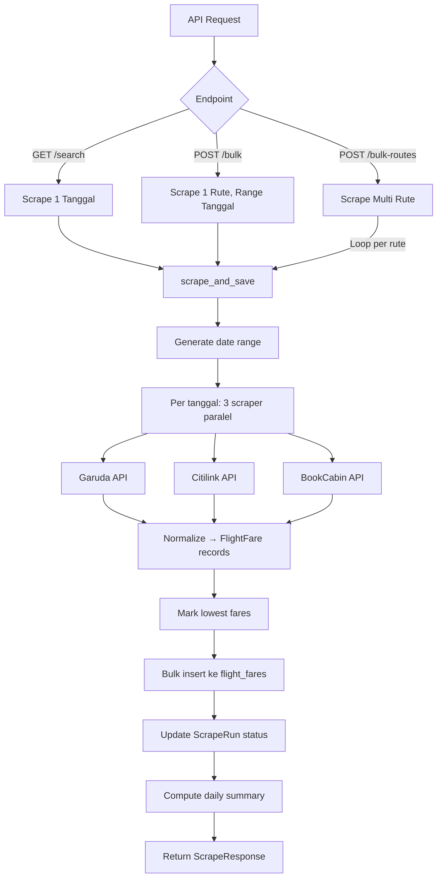

# 📋 Task Document — Aero Flight Fare Tracker

> **Tanggal**: 19 Februari 2026  
> **Status Proyek**: Frontend ✅ 100% (Mock Data) | Backend ✅ 100% (Scraping) | **Integrasi FE-BE ❌ 0%**

---

## 📐 Arsitektur Aplikasi

```
┌──────────────────┐       HTTP (axios)       ┌──────────────────────┐
│   CLIENT (FE)    │ ──────────────────────►  │    BACKEND (BE)      │
│   Next.js 16     │   localhost:3000          │    FastAPI           │
│   TailwindCSS 4  │        ↓                 │    localhost:8000    │
│   Radix UI       │   /api/flights/*         │    SQLAlchemy ORM    │
│   Recharts       │                          │    PostgreSQL        │
└──────────────────┘                          └──────────┬───────────┘
                                                         │
                          ┌──────────────────────────────┤
                          │           Scrapers            │
                          ├──────────┬───────────┬────────┤
                          │  Garuda  │ Citilink  │BookCabin│
                          │  API     │ dotREZ    │   API   │
                          │          │(JWT token)│(Lion,SAJ│
                          │          │           │BatikAir)│
                          └──────────┴───────────┴────────┘
```

---

## 📂 Struktur Proyek

```
aero/
├── backend/                    ← FastAPI + PostgreSQL
│   ├── app/
│   │   ├── main.py             ← Entry point, CORS, lifespan
│   │   ├── config.py           ← Pydantic settings (.env)
│   │   ├── database.py         ← SQLAlchemy engine + session
│   │   ├── models/
│   │   │   └── flight.py       ← ScrapeRun, FlightFare, FareDailySummary
│   │   ├── schemas/
│   │   │   └── flight.py       ← Pydantic request/response schemas
│   │   ├── routers/
│   │   │   └── flights.py      ← 8 API endpoints (/api/flights/*)
│   │   ├── scrapers/
│   │   │   ├── garuda.py       ← Garuda Indonesia API scraper
│   │   │   ├── citilink.py     ← Citilink dotREZ API scraper
│   │   │   └── bookcabin.py    ← BookCabin API (Lion, SAJ, Batik Air)
│   │   └── services/
│   │       ├── scraper_service.py  ← Orchestrator (paralel per tanggal)
│   │       └── export_service.py   ← Export XLSX format segitiga
│   ├── exports/                ← Output XLSX files
│   ├── .env                    ← DATABASE_URL, CITILINK_TOKEN
│   ├── Makefile                ← make dev / make run
│   └── requirements.txt
│
├── client/                     ← Next.js 16 Frontend
│   ├── app/
│   │   ├── layout.tsx          ← Root layout (Manrope + Sora fonts)
│   │   ├── page.tsx            ← Redirect → /dashboard
│   │   ├── login/page.tsx      ← Login page (mock auth)
│   │   ├── dashboard/page.tsx  ← Dashboard (mock data)
│   │   ├── routes/page.tsx     ← Routes table (mock data)
│   │   ├── analytics/page.tsx  ← Analytics charts (mock data)
│   │   ├── history/page.tsx    ← Scrape history log (mock data)
│   │   ├── export/page.tsx     ← Export Excel/CSV/JSON (mock data)
│   │   └── settings/page.tsx   ← App settings (mock)
│   ├── components/
│   │   ├── layout/             ← AppLayout, Sidebar, Header, BottomNav
│   │   ├── ui/                 ← 19 Radix UI components (shadcn)
│   │   ├── price-trend-chart.tsx
│   │   ├── notification-panel.tsx
│   │   └── global-search.tsx
│   ├── lib/
│   │   ├── axios.ts            ← Axios instance (baseURL: localhost:8000)
│   │   ├── export-excel.ts     ← Client-side export logic
│   │   ├── notifications.ts
│   │   └── utils.ts
│   ├── hooks/
│   │   ├── use-global-search.ts
│   │   └── use-notifications.ts
│   └── package.json
│
├── README.md
└── TASK_DOCUMENT.md            ← (dokumen ini)
```

---

## 🔄 Alur Kerja Aplikasi

### 1. Alur Scraping (Backend)



**Detail Langkah:**
1. Request masuk ke router → memanggil `scrape_and_save()`
2. Buat `ScrapeRun` record (status: RUNNING)
3. Generate list tanggal dari `start_date` sampai `end_date`
4. Per tanggal, jalankan 3 scraper **secara paralel** (`ThreadPoolExecutor`)
5. Setiap scraper: fetch API → parse response → normalize ke format `FlightFare`
6. Tandai `is_lowest_fare` per group (airline + travel_date)
7. Bulk insert semua records ke tabel `flight_fares`
8. Update `ScrapeRun` status → COMPLETED
9. Hitung agregasi harian → simpan ke `fare_daily_summary`

### 2. Alur Frontend (Client)

```mermaid
flowchart TD
    A[User buka app] --> B[/ → redirect /dashboard]
    B --> C[AppLayout: Sidebar + Header]
    C --> D{Navigasi}

    D --> E[Dashboard: Ringkasan + Chart + Tabel Harga]
    D --> F[Routes: 10 Rute Terpantau]
    D --> G[Analytics: Tren Harga + Perbandingan Maskapai]
    D --> H[History: Log Scraping]
    D --> I[Export: Download Excel/CSV/JSON]
    D --> J[Settings: Konfigurasi App]

    E --> K[⚠️ SEMUA MASIH MOCK DATA]
    F --> K
    G --> K
    H --> K
    I --> K
    J --> K
```

**Status Saat Ini:** Semua halaman frontend **100% selesai secara UI**, tetapi masih menggunakan **data dummy hardcoded**. Belum ada koneksi ke backend API.

---

## 🗃️ Database Schema

### Tabel 1: `scrape_runs` (Metadata Scraping)

| Field | Type | Deskripsi |
|-------|------|-----------|
| id | Integer PK | Auto increment |
| run_id | String(50) UNIQUE | UUID per eksekusi |
| run_type | String(10) | SCHEDULED / MANUAL |
| scraped_at | DateTime | Timestamp pengambilan |
| scrape_date | Date | Tanggal pengamatan |
| route | String(10) | Contoh: "BTH-CGK" |
| status | String(10) | RUNNING / COMPLETED / FAILED |
| total_records | Integer | Jumlah record berhasil |
| total_errors | Integer | Jumlah error |

### Tabel 2: `flight_fares` (Data Harga Primer)

| Field | Type | Deskripsi |
|-------|------|-----------|
| id | Integer PK | Auto increment |
| run_id | String FK | → scrape_runs.run_id |
| route | String(10) | "BTH-CGK" |
| airline | String(50) | "GARUDA INDONESIA" |
| source | String(30) | garuda_api / citilink_api / bookcabin_api |
| travel_date | Date | Tanggal terbang |
| flight_number | String(10) | "GA157" |
| depart_time | String(5) | "17:40" |
| arrive_time | String(5) | "19:30" |
| basic_fare | Numeric(15,2) | Harga tiket |
| currency | String(3) | "IDR" |
| source_type | String(15) | airline / bookcabin |
| is_lowest_fare | Boolean | Tandai termurah per group |
| status_scrape | String(10) | SUCCESS / FAILED |

### Tabel 3: `fare_daily_summary` (Agregasi Harian)

| Field | Type | Deskripsi |
|-------|------|-----------|
| route, airline, travel_date, scrape_date | Composite | Dimensi unik |
| daily_min_price | Numeric | Harga terendah hari itu |
| daily_avg_price | Numeric | Rata-rata harga |
| daily_max_price | Numeric | Harga tertinggi |
| price_change_dod | Numeric | Perubahan Day-over-Day |
| volatility | Float | Standar deviasi harga |
| cheapest_airline_per_day | String | Maskapai termurah |

---

## 🌐 API Endpoints

| Method | Endpoint | Deskripsi | Schema Request | Schema Response |
|--------|----------|-----------|----------------|-----------------|
| `GET` | `/api/flights/search` | Scrape 1 tanggal | Query params: origin, destination, date | `ScrapeResponse` |
| `POST` | `/api/flights/bulk` | Scrape 1 rute, range tanggal | `ScrapeRequest` | `ScrapeResponse` |
| `POST` | `/api/flights/bulk-routes` | Scrape multi rute (default 5 rute) | `BulkRoutesRequest` | `BulkRoutesResponse` |
| `POST` | `/api/flights/export` | Export ke XLSX segitiga | `ExportRequest` | FileResponse (XLSX) |
| `GET` | `/api/flights/history` | Query riwayat harga | Query params: route, airline, date range | `FlightFareOut[]` |
| `GET` | `/api/flights/runs` | List scrape runs | Query params: route, status | `ScrapeRunOut[]` |
| `GET` | `/api/flights/runs/{run_id}` | Detail 1 run | Path param: run_id | `ScrapeRunOut` |
| `GET` | `/api/flights/summary` | Agregasi harian (min/avg/max/DoD) | Query params: route, airline, dates | `FareDailySummaryOut[]` |

---

## 🔧 Scraper Detail

### Garuda Indonesia (`garuda.py`)
- **Endpoint:** `POST https://web-api.garuda-indonesia.com/ga/revamp/v1.0/dapi/airFare`
- **Autentikasi:** Tidak perlu token
- **Parse:** `flightData` + `pricingData` dari response JSON
- **Filter:** Hanya fare family ECO (COMFORT, AFFORDABLE, PROMO)

### Citilink (`citilink.py`)
- **Endpoint:** `POST https://dotrezapi-akm.prod.citilink.co.id/qg/dotrez/api/nsk/v1/availability/search/ssr`
- **Autentikasi:** JWT Bearer Token (dari browser DevTools)
- **Parse:** `journeysAvailableByMarket` + `faresAvailable`
- **⚠️ Token expired berkala** — perlu diperbarui manual

### BookCabin (`bookcabin.py`)
- **Endpoint:** `GET https://api-ibe.bookcabin.com/flight/v2/search`
- **Autentikasi:** Tidak perlu token
- **Airlines:** Lion Air (JT), Super Air Jet (IU), Batik Air (ID)
- **Filter:** Hanya penerbangan direct (tanpa transit)

---

## ✅ Yang Sudah Selesai

| Komponen | Status | Detail |
|----------|--------|--------|
| Backend API | ✅ 100% | 8 endpoint lengkap |
| Scraper Garuda | ✅ | fetch + parse + normalize |
| Scraper Citilink | ✅ | fetch + parse + normalize |
| Scraper BookCabin | ✅ | fetch + parse + normalize |
| Export XLSX | ✅ | Format segitiga |
| Database Schema | ✅ | 3 tabel + indexing |
| Summary Computation | ✅ | DoD, volatility, cheapest airline |
| Frontend UI | ✅ 100% | 7 halaman + 19 komponen UI |
| Layout Responsive | ✅ | Desktop sidebar + Mobile bottom nav |
| Axios Instance | ✅ | Configured ke localhost:8000 |

---

## ❌ Task yang Perlu Diselesaikan (Integrasi FE ↔ BE)

### 🔴 Prioritas Tinggi

#### Task 1: Koneksi Dashboard ke API
**File:** `client/app/dashboard/page.tsx`
- [ ] Ganti data mock "Ringkasan Data" → panggil `GET /api/flights/runs` + aggregate
- [ ] Ganti data mock "Pantauan Harga" table → panggil `GET /api/flights/history?limit=6`
- [ ] Ganti data mock "Rata-rata Harga" → panggil `GET /api/flights/summary`
- [ ] Buat tombol "Ambil Data Sekarang" → panggil `POST /api/flights/bulk-routes`
- [ ] Tambah loading state saat fetching data
- [ ] Tambah error handling dan retry

#### Task 2: Koneksi Routes ke API
**File:** `client/app/routes/page.tsx`
- [ ] Ganti `routesData` hardcoded → panggil `GET /api/flights/history` grouped by route
- [ ] Tampilkan harga terbaru (`basic_fare`) per rute dari data real
- [ ] Tambah status badge berdasarkan `status_scrape` terakhir

#### Task 3: Koneksi Analytics ke API
**File:** `client/app/analytics/page.tsx`
- [ ] Ganti `priceData` hardcoded → panggil `GET /api/flights/summary` untuk tren 30 hari
- [ ] Ganti `airlineData` hardcoded → aggregate dari `GET /api/flights/summary` per maskapai
- [ ] Hitung Harga Terendah, Rata-rata, Tertinggi dari data real

#### Task 4: Koneksi History ke API
**File:** `client/app/history/page.tsx`
- [ ] Ganti `logsData` hardcoded → panggil `GET /api/flights/runs`
- [ ] Format waktu dari `scraped_at` → readable format
- [ ] Hitung lowest price per run dari data `flight_fares`

#### Task 5: Koneksi Export ke Backend API
**File:** `client/app/export/page.tsx`
- [ ] Buat tombol "Export Excel" → panggil `POST /api/flights/export` dan download file
- [ ] Filter berdasarkan rute dan maskapai sebelum export
- [ ] Pertahankan export CSV/JSON client-side menggunakan data dari API

#### Task 6: Koneksi Price Trend Chart
**File:** `client/components/price-trend-chart.tsx`
- [ ] Ganti data chart hardcoded → panggil `GET /api/flights/summary`
- [ ] Format data untuk Recharts (date → label, prices → values)

### 🟡 Prioritas Sedang

#### Task 7: Implementasi Auth yang Benar
**File:** `client/app/login/page.tsx`
- [ ] Buat endpoint auth di backend (atau hapus login jika tidak diperlukan)
- [ ] Saat ini login mock — simpan ke localStorage tanpa validasi
- [ ] Tambah middleware/guard untuk halaman yang protected

#### Task 8: Settings — Koneksi ke Backend Config
**File:** `client/app/settings/page.tsx`
- [ ] Buat endpoint `GET/PUT /api/settings` di backend
- [ ] Kontrol jadwal scraping dan scrape delay dari UI
- [ ] Kelola Citilink token dari UI settings

#### Task 9: Notification System
**Files:** `client/hooks/use-notifications.ts`, `client/components/notification-panel.tsx`
- [ ] Buat notifikasi real berdasarkan event scraping (berhasil/gagal)
- [ ] Tambah notifikasi ketika harga turun signifikan (price alert)

#### Task 10: Global Search
**Files:** `client/hooks/use-global-search.ts`, `client/components/global-search.tsx`
- [ ] Sambungkan search ke backend → cari berdasarkan rute, maskapai, flight number
- [ ] Buat endpoint `GET /api/flights/search-text` atau gunakan filter pada endpoint existing

### 🟢 Prioritas Rendah

#### Task 11: Scheduled Scraping
- [ ] Implementasi scheduler (APScheduler / Celery) di backend
- [ ] Cron job otomatis setiap hari jam 07:30 WIB
- [ ] Log scheduled runs dengan `run_type: "SCHEDULED"`

#### Task 12: Error Monitoring & Retry
- [ ] Tambah retry logic pada setiap scraper (saat timeout/rate limit)
- [ ] Dashboard monitoring error rate per scraper
- [ ] Alert ketika error rate > threshold

#### Task 13: Citilink Token Management
- [ ] Token saat ini harus diambil manual dari browser DevTools
- [ ] Pertimbangkan auto-refresh atau notifikasi ketika token expired
- [ ] Buat UI input token di Settings page

---

## 🚀 Cara Menjalankan

### Backend
```bash
cd backend
python -m venv .venv
.\.venv\Scripts\Activate.ps1    # Windows PowerShell
pip install -r requirements.txt
make dev                         # http://localhost:8000
```

### Frontend
```bash
cd client
bun install
bun dev                          # http://localhost:3000
```

### Prasyarat
- Python 3.11+
- Node.js / Bun
- PostgreSQL database (`aero`)
- Citilink JWT token (opsional, untuk scraping Citilink)

---

## 🗺️ Rute yang Dimonitor

| # | Rute | Maskapai | Sumber Scraping |
|---|------|----------|-----------------|
| 1 | BTH → CGK | Garuda Indonesia | Garuda API |
| 2 | BTH → CGK | Citilink | Citilink API |
| 3 | BTH → CGK | Lion Air | BookCabin API |
| 4 | BTH → CGK | Super Air Jet | BookCabin API |
| 5 | BTH → KNO | Lion Air | BookCabin API |
| 6 | BTH → SUB | Lion Air | BookCabin API |
| 7 | BTH → PDG | Lion Air | BookCabin API |
| 8 | TNJ → CGK | Garuda Indonesia | Garuda API |
| 9 | TNJ → CGK | Citilink | Citilink API |
| 10 | TNJ → CGK | Batik Air | BookCabin API |

---

## 📊 Urutan Pengerjaan yang Disarankan

```
1. Task 4 (History)     ← Paling straightforward, 1 endpoint langsung mapping
2. Task 2 (Routes)      ← Data tabel sederhana
3. Task 1 (Dashboard)   ← Butuh aggregate data dari multiple endpoints
4. Task 6 (Chart)       ← Bergantung pada summary endpoint
5. Task 3 (Analytics)   ← Butuh summary data + formatting
6. Task 5 (Export)      ← File download dari backend
7. Task 7-13            ← Enhancement & nice-to-have
```
